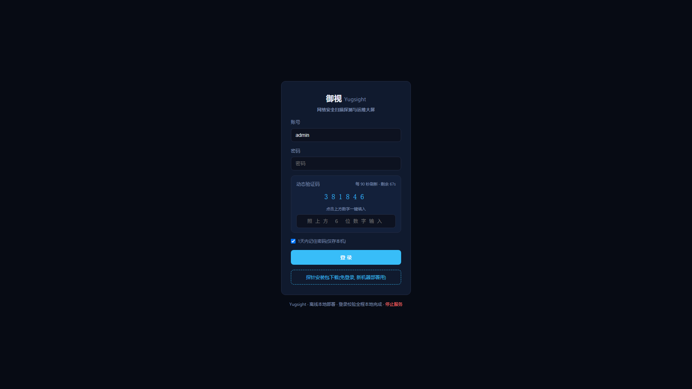
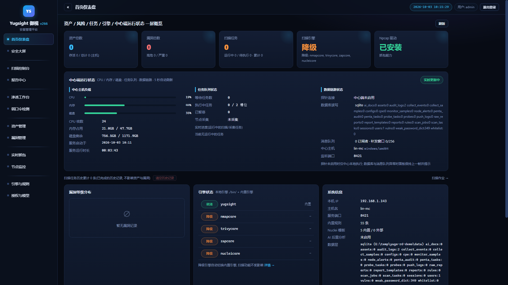
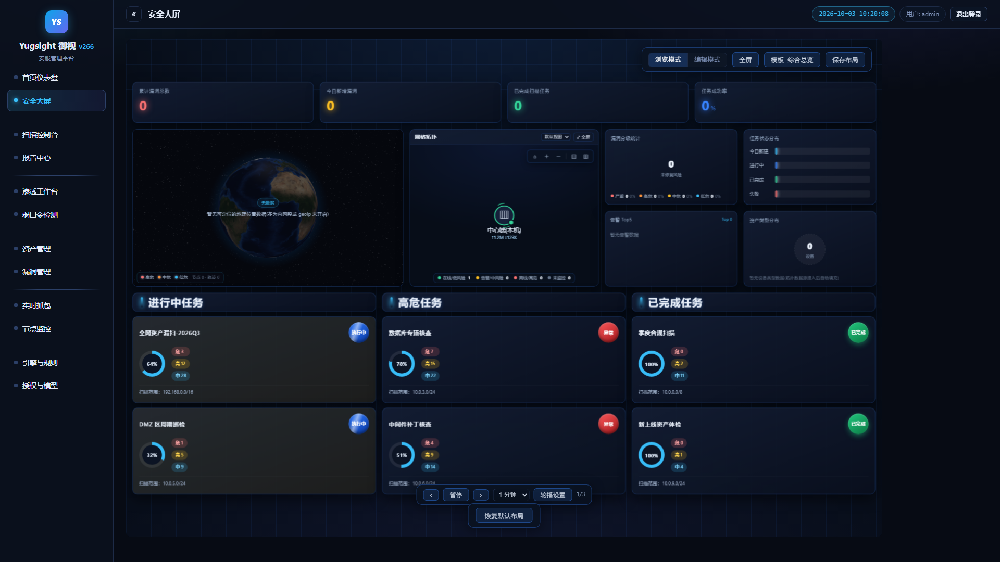
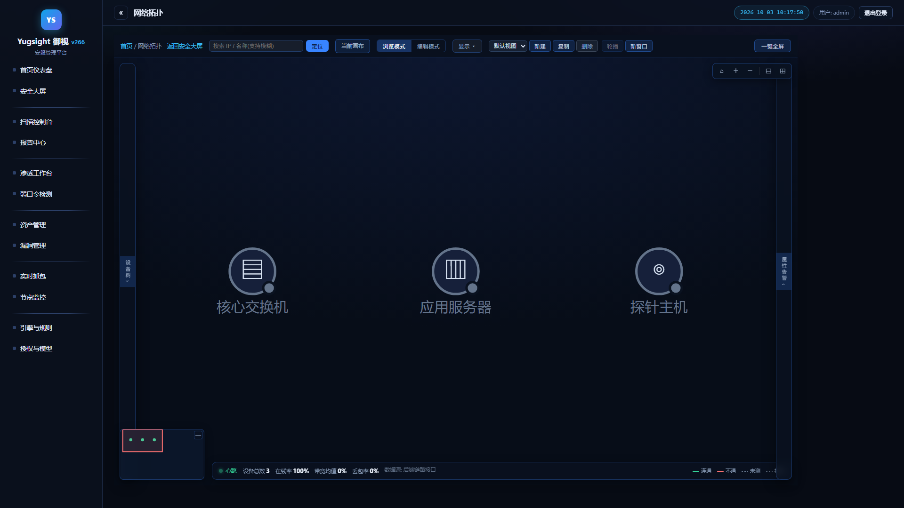
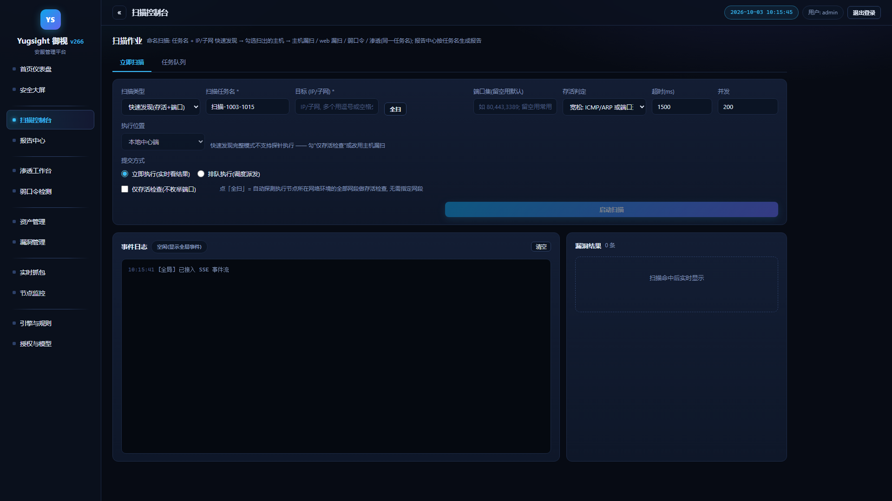
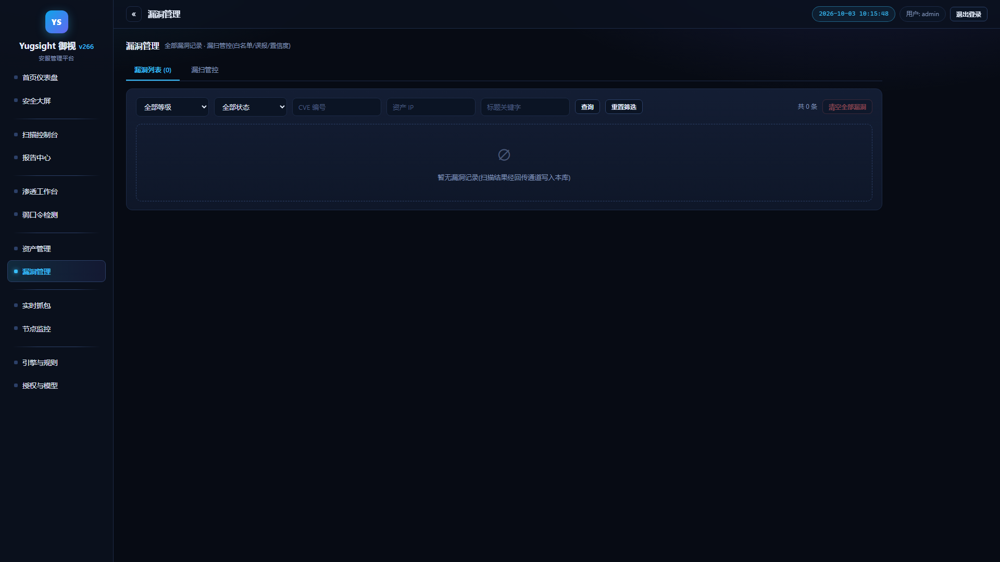
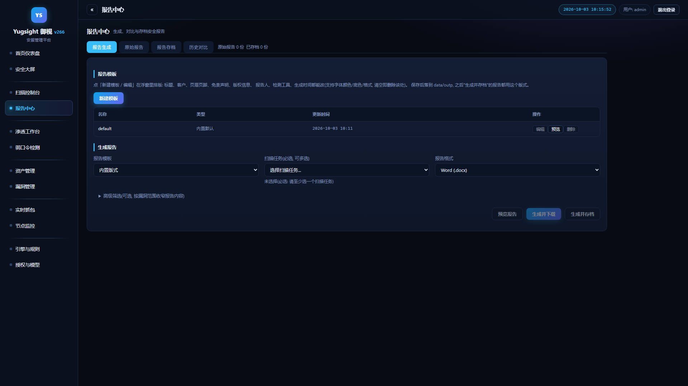
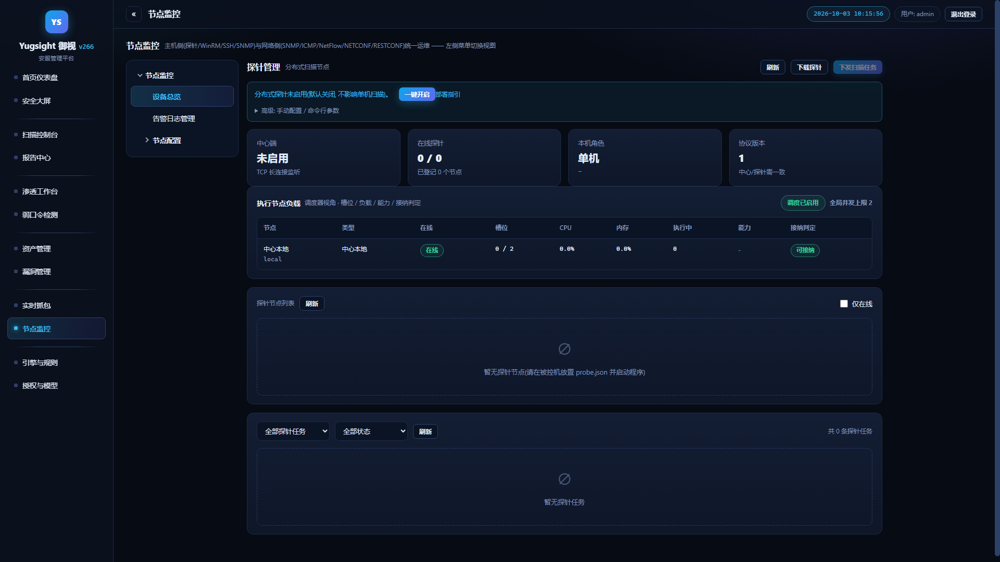
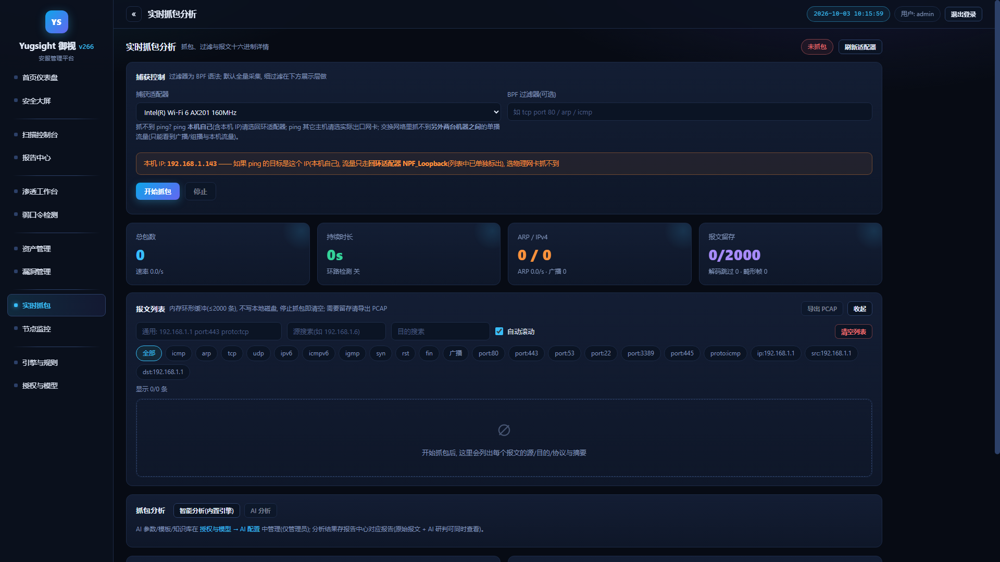

# Yugsight (御视) · Network Scanning & Probing Tool

**English** | [简体中文](README.md)

An offline, single-executable intranet security operations platform with an embedded Vue3 Web UI (the browser opens automatically on startup). Built purely on the Go standard library (the only exception is YAML parsing, `gopkg.in/yaml.v3`, for Nuclei templates), with zero external service dependencies.

- **Center**: one executable containing the Web UI and the full scanning / monitoring capability. External engines (nmap / trivy / ZAP) are preferred when installed; when missing or failing, it automatically degrades to the built-in engine — the full feature set works with no external engine installed at all.
- **Probe agent**: a separate small binary (`yugsight-agent.exe`) deployed on the machines to be scanned; it opens a single outbound connection to the center and listens on **no** inbound port. Without probes the center works standalone; with probes, collection extends across network segments and into the machine system layer (middleware, databases, processes / services).

## Features

| Module | Description |
|---|---|
| IP liveness scan | CIDR / range / single IP, ICMP + TCP dual probe, strict / loose / no-liveness |
| Port scan | Custom ports (`80,443,500-600`), service name / banner / latency |
| Web vulnerability scan | Security headers, TLS, 35+ sensitive paths, SQLi / XSS / path traversal + 8,746 vulnerability rules (per-rule opt-out) |
| Host scan | OS fingerprinting, service version → CVE matching (CPE library: 33 products / 4,043 CVE, one-click NVD sync) |
| External engines (optional) | One-click download & install for nmap / trivy / ZAP / nuclei; external preferred, automatic fallback to built-in |
| Weak / empty password (off by default) | Real probing against 10 protocols, built-in + custom dictionaries, whitelist + rate limit + audit |
| Live packet capture | One-click Npcap install, full capture + in-page filtering, packet list / detail / hex, PCAP export, loop detection |
| Nuclei template scan | Built-in + official templates, tag filtering, hot update, online update / rollback |
| Vulnerability management | Whitelist (ip / cidr / port / cve / tag) + manual false-positive marking + confidence scoring |
| Distributed scanning | Probe agents: node reporting, task dispatch, probe-local scan / capture / enumeration / SYN / ARP anomaly detection, package download & auto-update |
| Node monitoring (off by default) | Host side (agent + agentless WinRM / SSH / SNMP) + network side (SNMP / ICMP / NetFlow / NETCONF / RESTCONF); scheduling / rate limiting / time series / anomaly events |
| Alert push (off by default) | Node alerts (offline / recovery / threshold breach) are pushed automatically to WeCom / DingTalk / Feishu via webhook, matched by rules (severity / time window / do-not-disturb), retry on failure, acknowledge / ignore, auditable push logs |
| Network topology | 2D canvas, multiple independent views (server-side persistence, cross-browser sync), device library drag-and-drop binding to real devices, manual linking + port binding (real-rate labels), link connectivity testing (three states + auto-retry / periodic re-verify), subnet collapse / drill-down, free boxes, traffic light effects |
| Security big screen | Standalone full-screen page, free canvas + card layout, drag & marquee, one-click browser fullscreen projection |
| Task scheduling | Queue, priority / concurrency / per-CIDR rate limits, strategy templates, probe routing; scan history (rescan / cancel / batch delete) |
| Vulnerability reports | One-click HTML / PDF / Word export, visual layout template editor, risk scoring / remediation suggestions / history comparison |
| Report center | Automatic archiving of raw results (capture / scan / weakpass / monitoring), multi-select merge, multi-dimension filter, AI analysis mounting |
| Dashboard | Overview dashboard (5s refresh) + embedded security big screen (15s refresh) |
| AI full-pipeline analysis (optional, off by default) | Prompt templates / RAG document library / structured memory library; Ollama / OpenAI-compatible, enforced de-identification |
| AI assistant "Xiao Y" (optional) | Page-context-aware Q&A with SSE streaming answers |
| Pentest workbench (admin only) | Verification pentesting on known vulnerabilities only (scan discovers, pentest verifies); EXP template library + weak-password verification; independent non-deletable pentest audit trail |
| Roles & permissions | admin / operator / auditor roles; login = account + password + 6-digit dynamic code (refreshed every 90s, shown in large text on the login page) |
| Factory reset | Wipe all data and caches, recreate the admin account, fully audited |
| Bilingual UI | Full-site one-click Chinese / English switch (login page, top bar, probe install landing page — the landing page has the same toggle and stays in sync with the UI); preference remembered per browser and shared with the landing page, default Chinese |

The UI is Vue3 (default home `/app/`); the classic single-file UI remains at `/classic/`.

## Screenshots

> All from a fresh install, first-run state (dark theme, 1920×1080; the topology uses sample 10.10.10.x devices).

| Login | Dashboard | Security Big Screen |
|---|---|---|
|  |  |  |
| Network Topology | Scan Console | Vulnerabilities |
|  |  |  |
| Report Center | Node Monitoring | Live Capture |
|  |  |  |

## Quick Start

1. Double-click `yugsight_windows_amd64.exe` (UAC elevation on first launch)
2. The browser opens `http://<your-ip>:8420`; log in with `admin / admin123` + the 6-digit dynamic code (shown in large text on the login page, refreshed every 90 seconds)
3. Pick a module, fill in the parameters, start the scan — results stream in live; generate a report from the **Report Center** when done

- The program stays resident as a console window (auto-minimized); closing the window does **not** stop the service. **Stop service**: link at the bottom of the login page, or **License & Model → Service Management** (no login required)
- Binds `0.0.0.0` by default (stays reachable even if the machine's IP changes); use `-bind-local` to bind only the LAN IP
- Plain HTTP by default; for HTTPS set `enabled: true` in the `tls` section of `settings.json` and restart (a self-signed certificate is generated automatically; follow the "Install root certificate" guide on the login page)
- Live packet capture requires Npcap (one-click install in the UI); when external engines are absent the built-in engine works as usual

## Build

Requires Go 1.25+ (Node 20+ as well if you modify the front end, and run `npm run build` in `app/frontend` first).

```powershell
powershell -ExecutionPolicy Bypass -File scripts/build.ps1 -OutDir dist     # center (auto version bump + icon injection)
powershell -ExecutionPolicy Bypass -File scripts/build-agents.ps1           # probe agent (6 platform packages)
```

- The version lives in `VERSION`; the script bumps it on every build. Keep only the platform-suffixed binary (`yugsight_windows_amd64.exe`) — do not leave a short-named `yugsight.exe` next to it (different process name; the old instance would keep holding port 8420).
- Reports / templates / rule libraries / config live next to the executable; no rebuild needed.

## License

The community edition is released under the **MIT License**; everything runs locally and offline — no data ever leaves your machine. The code is fully open source and auditable. Use it only on targets where you have legitimate authorization.

For commercial licensing / enterprise customization, please contact us via GitHub Issues.
